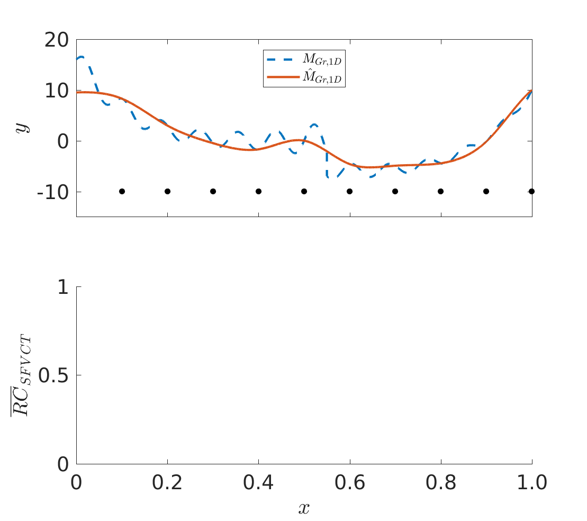

# Matlab Implementation Of State-Of-The-Art Adapative Techniques for Ordinary Kriging

The following library provides a Matlab implementation of Ordinary Kriging accompanied by the most commonly used adaptive sampling techniques. For a comparative review of these methods test cases are provided within this framework.

## Getting Started

We encourage those who are interested in using this library to run and pick a random input adaptive method and benchmark function.
Run [`main.m`] and follow the instructions for user input. 1D and 2D benchmark functions allow for updated visualization of the adaptive process.

### Prerequisites

Matlab version R2017a or higher.

## Examples 

Example of a 1D adaptive sampling process with the SFVCT technique. Upper image target function (red dashed), metamodel (blue) and sample positions.
Lower image sample positions, optimization function for next sample (blue), position of new sample (red dashed). Red areas are constraints on the optimization space. 

---
---
Example of a 2D adaptive sampling process with the MEPE technique. Current metamodel over parametric space.
Lower image sample positions (black dots), new found sample (red dot) and local normalized mean absolute error as contour lines over the parametric space. 

#### List of Adaptive Sampling Techniques

 - Smart Sampling Algorithm (SSA)
   Garud, Sushant Suhas, Iftekhar A. Karimi, and Markus Kraft. "Smart sampling algorithm for surrogate model development." Computers & Chemical Engineering 96 (2017): 103-114

 - Cross-Validation-Voronoi (CVVOR)
   Xu, Shengli, et al. "A robust error-pursuing sequential sampling approach for global metamodeling based on voronoi diagram and cross validation." Journal of Mechanical Design 136.7 (2014): 071009.

 - ACcumulative Error (ACE)
   Li, Genzi, Vikrant Aute, and Shapour Azarm. "An accumulative error based adaptive design of experiments for offline metamodeling."Structural and Multidisciplinary Optimization 40.1-6 (2010): 137.

 - MC-intersite-proj-th (MIPT)
   Crombecq, Karel, Eric Laermans, and Tom Dhaene. "Efficient space-filling and non-collapsing sequential design strategies for simulation-based modeling."European Journal of Operational Research 214.3 (2011): 683-696.

 - LOLA-Voronoi (LOLA)
   Crombecq, Karel, et al. "A novel hybrid sequential design strategy for global surrogate modeling of computer experiments."SIAM Journal on Scientific Computing 33.4 (2011): 1948-1974.

 - Adaptive Maximum Entropy (AME)
   Liu, Haitao, et al. "An adaptive Bayesian sequential sampling approach for global metamodeling." Journal of Mechanical Design 138.1 (2016): 011404.

 - Maximizing Expected Prediction Error (MEPE)
   Liu, Haitao, Jianfei Cai, and Yew-Soon Ong. "An adaptive sampling approach for kriging metamodeling by maximizing expected prediction error."Computers & Chemical Engineering 106 (2017): 171-182.

 - Mixed Adaptive Sampling Algorithm (MASA)
   Eason, John, and Selen Cremaschi. "Adaptive sequential sampling for surrogate model generation with artificial neural networks." Computers & Chemical Engineering 68 (2014): 220-232.

 - Weighted Accumulative Error (WAE)
   Jiang, Ping, et al. "A novel sequential exploration-exploitation sampling strategy for global metamodeling."IFAC-PapersOnLine 48.28 (2015): 532-537.

 - Sampling with Lipschitz Criterion (LIP)
   Lovison, Alberto, and Enrico Rigoni. "Adaptive sampling with a Lipschitz criterion for accurate metamodeling." Communications in Applied and Industrial Mathematics 1.2 (2011): 110-126.

 - Taylor expansion-based adaptive design (TEAD)
   Mo, Shaoxing, et al. "A Taylor expansion‐based adaptive design strategy for global surrogate modeling with applications in groundwater modeling."Water Resources Research 53.12 (2017): 10802-10823.

 - Space-Filling Cross Validation Tradeoff (SFCVT)
   Aute, Vikrant, et al. "Cross-validation based single response adaptive design of experiments for Kriging metamodeling of deterministic computer simulations."Structural and Multidisciplinary Optimization 48.3 (2013): 581-605.

 - Expected improvement (EI)
   Jones, Donald R., Matthias Schonlau, and William J. Welch. "Efficient global optimization of expensive black-box functions."Journal of Global optimization 13.4 (1998): 455-492.

 - Expected improvement for global fit (EIGF)
   Lam, Chen Quin. "Sequential adaptive designs in computer experiments for response surface model fit."Diss. The Ohio State University, 2008.

### References

If you use part of the work consider citing:
Fuhg, Jan N., Amélie Fau, and Udo Nackenhorst. "State-of-the-Art and Comparative Review of Adaptive Sampling Methods for Kriging." Archives of Computational Methods in Engineering (2020): 1-59.
